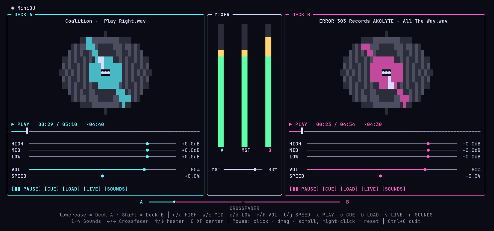

# MiniDJ for Omarchy

A minimal two-deck DJ controller that lives in your Omarchy bar. Click the
record icon next to Bluetooth and Wi‑Fi and a floating terminal opens with two
spinning ASCII vinyls, a 3-band EQ per deck, speed, a crossfader and sound-effect
pads. Load tracks from any folder or USB stick, or pull the audio of another app
(Spotify, a browser tab, …) into a deck and mix it live.



## Features

- **Two decks:** play/pause, CUE, seek bar, spinning vinyl
- **Per deck:** HIGH / MID / LOW EQ (+6 dB down to kill), volume, speed ±50 % (pitch follows, like vinyl)
- **Mixer:** level meters, master volume, constant-power crossfader
- **File browser:** shows only audio files and jumps straight to USB sticks (`/run/media/$USER`), `~` or `~/Music`
- **Live mode:** reroutes another app's playback stream through a deck via PipeWire, so EQ, volume and crossfader apply to it; the app is routed back when you stop or quit
- **Sound pads:** air horn, dub siren, laser, scratch (synthesized, no sample files)
- **Mouse and keyboard:** click or drag sliders, scroll to fine-tune, right-click to reset

## Install

```bash
omarchy plugin add https://github.com/henrysommer/omarchy-minidj.git --enable
```

Pick the `right` section when asked, then move the icon next to Bluetooth:

```bash
omarchy bar move henrysommer.minidj --before omarchy.bluetooth
```

The first click sets up a private Python environment in `~/.local/share/minidj`
(numpy, scipy, sounddevice). That takes about a minute; later starts are instant.

**Requirements:** a current Omarchy with the Quickshell bar, PipeWire with
`pipewire-pulse`, `python`, `ffmpeg` and `libpulse` (for `pactl`/`parec`). All of
these ship with a stock Omarchy install.

The first launch also adds one window rule to `~/.config/hypr/hyprland.lua` so
MiniDJ opens as a centered 1240×820 floating window (it needs ~116 columns).

You can also start it from a terminal: `~/.config/omarchy/plugins/henrysommer.minidj/bin/minidj [trackA] [trackB]`.

## Controls

Lowercase keys control deck A, the same keys with Shift control deck B.

| Key | Action | Key | Action |
|---|---|---|---|
| `q` / `a` | HIGH up / down | `x` | play / pause |
| `w` / `s` | MID up / down | `c` | CUE |
| `e` / `d` | LOW up / down | `b` | load file |
| `r` / `f` | volume up / down | `v` | live app audio |
| `t` / `g` | speed up / down | `n` | sound pads |
| `1`–`4` | fire sound effect | `←` / `→` | crossfader |
| `0` | center crossfader | `↑` / `↓` | master volume |

Quit with `Ctrl+C` or `F10`.

## Uninstall

```bash
omarchy plugin remove henrysommer.minidj
rm -rf ~/.local/share/minidj
```

Then delete the `MiniDJ` window rule at the end of `~/.config/hypr/hyprland.lua`.

## Development

```bash
scripts/dev-sync.sh   # validate, copy into ~/.config/omarchy/plugins and link launchers
```

The audio engine is in `app/engine.py`, the curses UI in `app/minidj.py` and
the sound effects in `app/fx.py`.

## License

MIT
